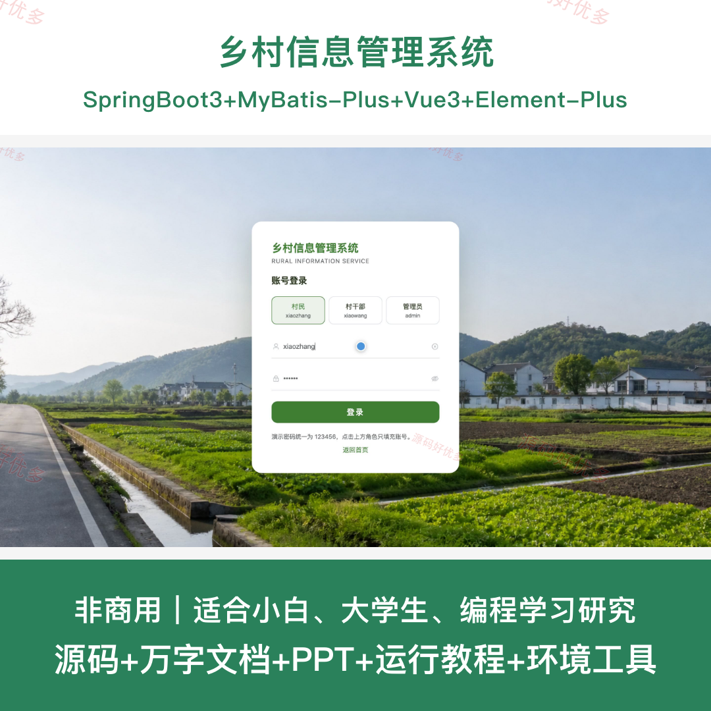
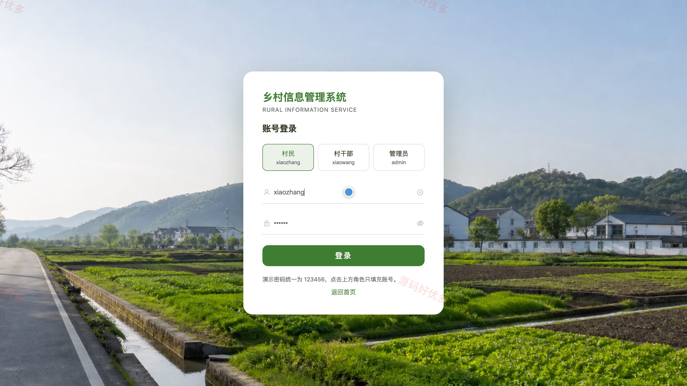
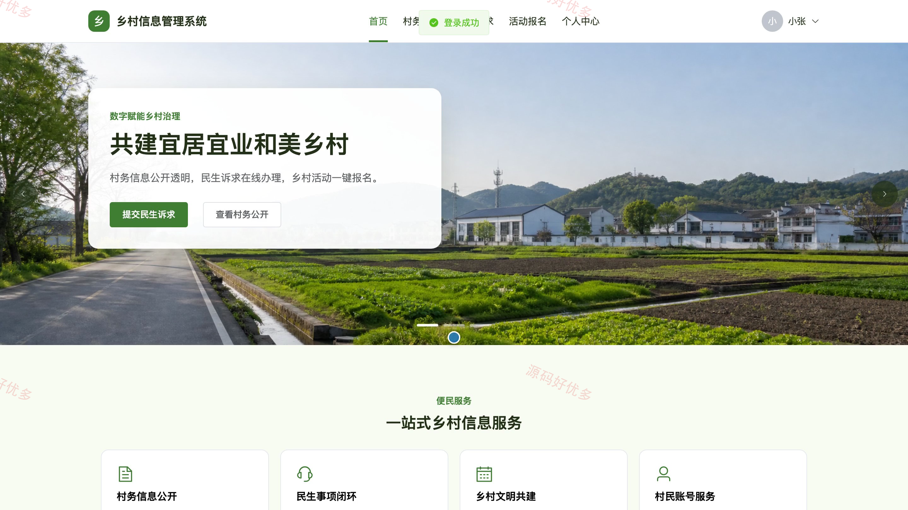
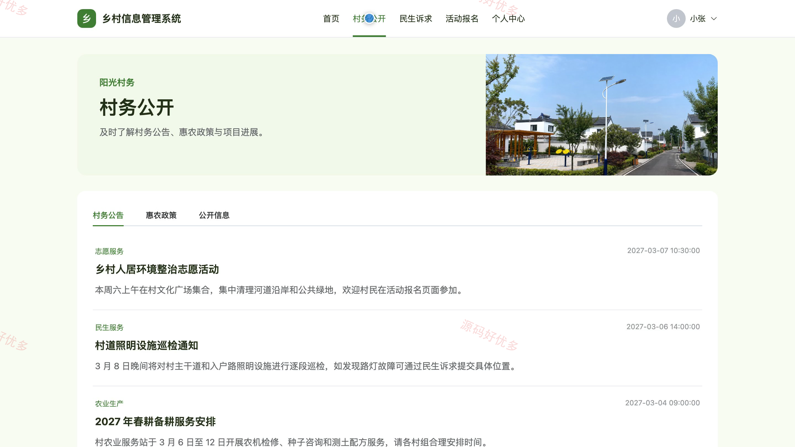
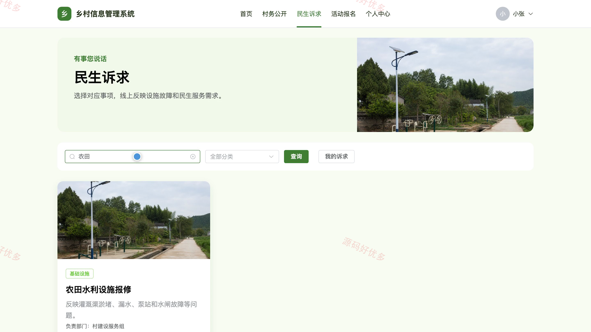
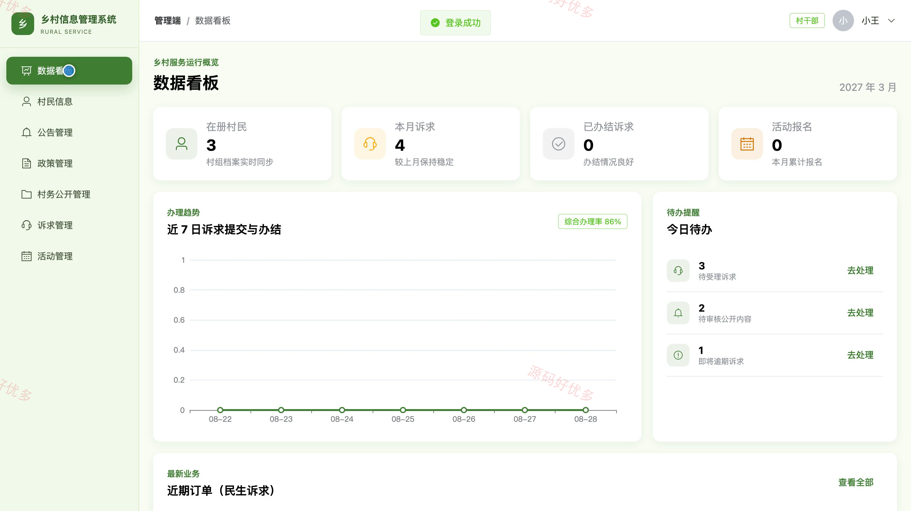
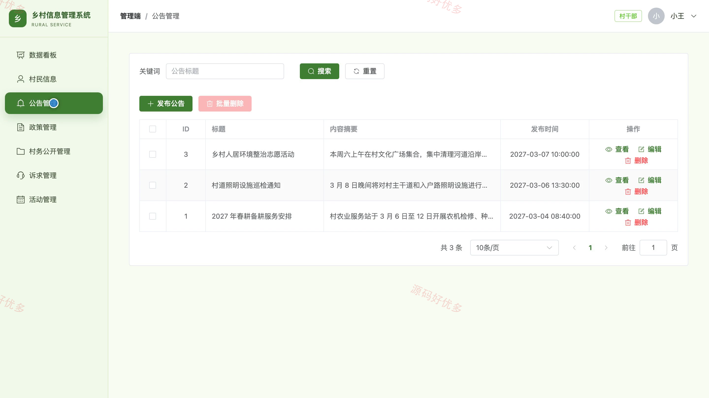
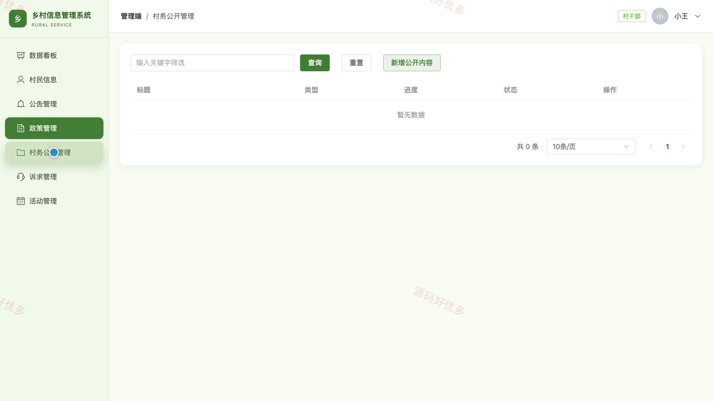
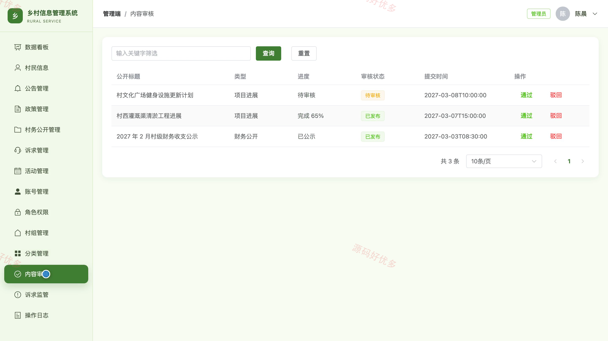

## 源码问题查看主页咨询

### 一、关键词
乡村治理、村务公开、民生诉求、惠农政策、乡村活动

### 二、作品包含
源码+数据库+万字设计文档+PPT+全套环境和工具资源+本地部署教程

### 三、项目技术
前端技术： Html、Css、Js、Vue3.4、Element-Plus
后端技术：Java、SpringBoot3.2.0、MyBatis-Plus

### 四、运行环境（以下版本亲测，其他版本兼容性请自行测试）
开发工具：IDEA/eclipse + VSCODE

数据库：MySQL5.7+（共16张表）

数据库管理工具：Navicat10以上版本

环境配置软件： JDK17 + Maven

前端Nodejs：20

浏览器：谷歌浏览器

### 五、项目介绍
项目编号：bs088A

系统面向乡村基层治理与村民便民服务，将村务公告、惠农政策、公开信息、民生诉求和乡村活动纳入统一平台。村民可在前台查询公开内容、提交诉求并跟踪办理进度、参与活动；村干部负责村民信息、公告政策、村务公开、诉求办理和活动管理；管理员负责账号权限、村组与分类、内容审核、诉求监管和操作日志。

角色：村民、村干部、管理员

村民功能：村务公告浏览、惠农政策查询、村务公开查看、民生诉求提交、诉求进度跟踪、乡村活动报名、个人信息维护、登录密码修改。

村干部功能：乡村数据看板、村民信息管理、公告政策管理、村务公开管理、民生诉求办理、乡村活动管理、个人资料维护。

管理员功能：乡村数据看板、账号信息管理、角色权限管理、村组信息管理、业务分类管理、村务内容审核、民生诉求监管、操作日志查看。

### 六、运行截图

